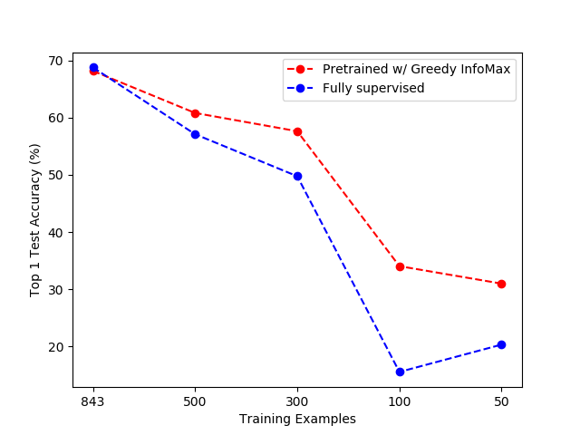
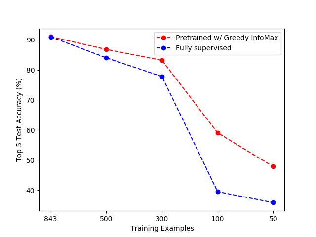

# Using Greedy InfoMax with PointNet++
We use the Greedy InfoMax algorithm to train a PointNet++. 
In contrast to the original Greedy Infomax algorithm, where patches are created from highly regular data fromats, such as images and audio, we create patches directly from unordered sets of 3D points.
This is possible by utilizing the query and grouping functions used in the PointNet++ algorithm. 
Each 1024-point 3D point clouds are queried using a 4x4x4 cube with positions [-0.6, -0.2, 0.2, 0.6] in all 3 axes, using a sphere query of radius 0.4.
The result is up to 64 256-point 3D point clouds sampled from the original point cloud.
Two examples of this querying and grouping can seen below.

 
    

The Greedy Infomax objective has been adapted for a 3D cube of "patches" instead of 2D and 1D representations of images and audio from the original paper.
As you might see, due to the irregular shapes of 3D models, for some positions in the cube, there won't be any 3D points to gather.
These groups are ignored and do not contribute to the input gradient during unsupervised learning.

The algorithm may be used in learning deep representations of 3D point clouds using large unlabeled datasets, which can then be used in both classification and semantic segmentation.

## Dependencies and Usage
TBD

## Early Experiments
The 9843 models in the training dataset of ModelNet40 have been divided into unsupervised training data (9000) and supervised training data (843).

Greedy InfoMax have been performed on the unsupervised data for 205 epochs using default hyperparameters.

The network has been fine-tuned using the training data, for 200 epochs, training only the fully-connected layers of the model.
For comparison, classification training has been performed in a fully supervised manner by training the whole network end-to-end, with randomly initialized parameters. 

Initial results show that with a very small amount of training data, we can indeed see a performance gain, if pre-training on unlabeled data.

#### Top 1 Test Accuracy

 
    

#### Top 5 Test Accuracy

 
    

## Acknowledgements
* [loeweX/Greedy_InfoMax](https://github.com/loeweX/Greedy_InfoMax): Paper author and official repo, Greedy Infomax.
* [charlesq34/pointnet2](https://github.com/charlesq34/pointnet2): Paper author and official code repo, PointNet++.
* [sshaoshuai/Pointnet2.PyTorch](https://github.com/sshaoshuai/Pointnet2.PyTorch): PyTorch implementation of PointNet++, mainly used in this repo.

## Papers
* [Putting An End to End-to-End: Gradient-Isolated Learning of Representations - Löwe et al.](https://arxiv.org/abs/1905.11786)
* [PointNet++: Deep Hierarchical Feature Learning on Point Sets in a Metric Space - Qi et al.](https://arxiv.org/abs/1706.02413)

