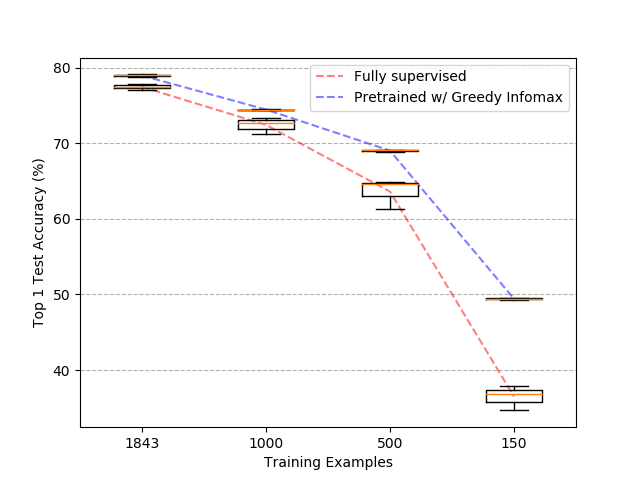
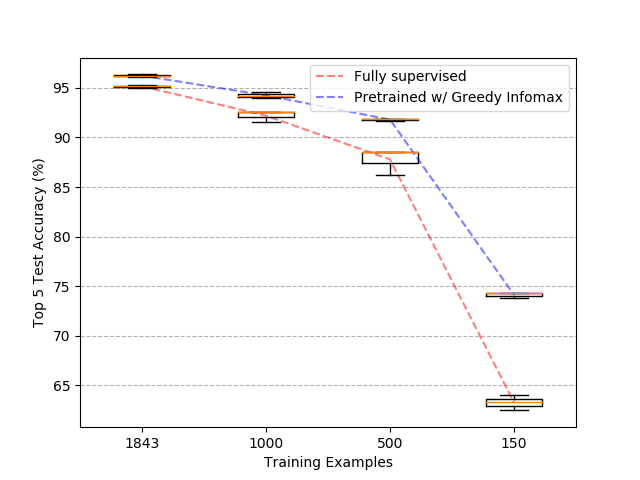

# Using Greedy InfoMax with PointNet++
In contrast to the original Greedy Infomax algorithm, where patches are created from highly regular data formats, such as images and audio, we create patches directly from unordered sets of 3D points.
This is possible by utilizing the query and grouping functions used in the PointNet++ algorithm. 
Each 1024-point 3D point clouds are queried using a 3x3x3 cube with positions [-0.5, 0, 0.5] in all 3 axes, using a sphere query of radius 0.5.
The result is up to 27 256-point 3D point clouds sampled from the original point cloud.
Two examples of this querying and grouping can be seen below.

<p align="center"> 
    
</p>

The Greedy Infomax objective has been adapted for a 3D cube of "patches" instead of 2D and 1D representations of images and audio from the original paper.
As you might see, due to the irregular shapes of 3D models, for some positions in the cube, there won't be any 3D points to gather.
These groups are ignored and do not contribute to the input gradient during unsupervised learning.

The algorithm may be used in learning deep representations of 3D point clouds using large unlabeled datasets, which can then be used in both classification and semantic segmentation.

## Experiments
The 9843 models in the training dataset of ModelNet40 have been divided into unsupervised training data (8000) and supervised training data (1843).

Greedy InfoMax has been performed on the unsupervised data for 300 epochs using default hyperparameters.

The network has been fine-tuned using the training data, for an additional 300 epochs, training only the fully-connected layers of the model.
For comparison, classification training has been performed in a fully supervised manner by training the whole network end-to-end, with randomly initialized parameters. 

Initial results show that we can indeed see a performance gain when pre-training on unlabeled data. 
With a very small amount of labeled data, the performance difference is even greater.
For each entry in the plots below, I trained three models using randomly initialized network weights, for a more robust comparison.

#### Top 1 Test Accuracy

<p align="center"> 
    
</p>

#### Top 5 Test Accuracy

<p align="center"> 
    
</p>

## Requirements
- Linux (tested on Ubuntu 14.04/16.04/18.04)
- [Conda](https://www.anaconda.com/)
## Installation
Setup the conda environment by running
```sh
conda env install -f environment.yml
conda activate infomax

# Install PointNet libs 
cd PointNet2/pointnet2/
python setup.py install
cd ../../

# Fix pptk issue
cd ~/miniconda3/envs/infomax/lib/python3.6/site-packages/pptk/libs/
mv libz.so.1 libz.so.1.old
ln -s /lib/x86_64-linux-gnu/libz.so.1
```
## Example usage
Visualize point cloud and querying
```
python -m GreedyInfoMax.pointnet.plot_subclouds --name_of_3dmodel airplane/airplane_0630.ply
```
Unsupervised training
```
python -m GreedyInfoMax.pointnet.train_encoder --save_dir pointnet_encoder0 --num_unsupervised_training_samples 8000
```
Supervised classifier training after unsupervised training
```
python -m GreedyInfoMax.pointnet.train_classifier --loss classifier --model_path ~/Greedy_InfoMax_with_PointNet/logs/pointnet_encoder0 --save_dir pointnet_cls0 --num_unsupervised_training_samples 8000
```
Fully supervised training
```
python -m GreedyInfoMax.pointnet.train_classifier --loss supervised --save_dir pointnet_supercls0 --num_unsupervised_training_samples 8000
```


## Acknowledgements
* [loeweX/Greedy_InfoMax](https://github.com/loeweX/Greedy_InfoMax): Paper author and official repo, Greedy Infomax.
* [charlesq34/pointnet2](https://github.com/charlesq34/pointnet2): Paper author and official code repo, PointNet++.
* [sshaoshuai/Pointnet2.PyTorch](https://github.com/sshaoshuai/Pointnet2.PyTorch): PyTorch implementation of PointNet++, mainly used in this repo.

## Papers
* [Putting An End to End-to-End: Gradient-Isolated Learning of Representations - Löwe et al.](https://arxiv.org/abs/1905.11786)
* [PointNet++: Deep Hierarchical Feature Learning on Point Sets in a Metric Space - Qi et al.](https://arxiv.org/abs/1706.02413)

